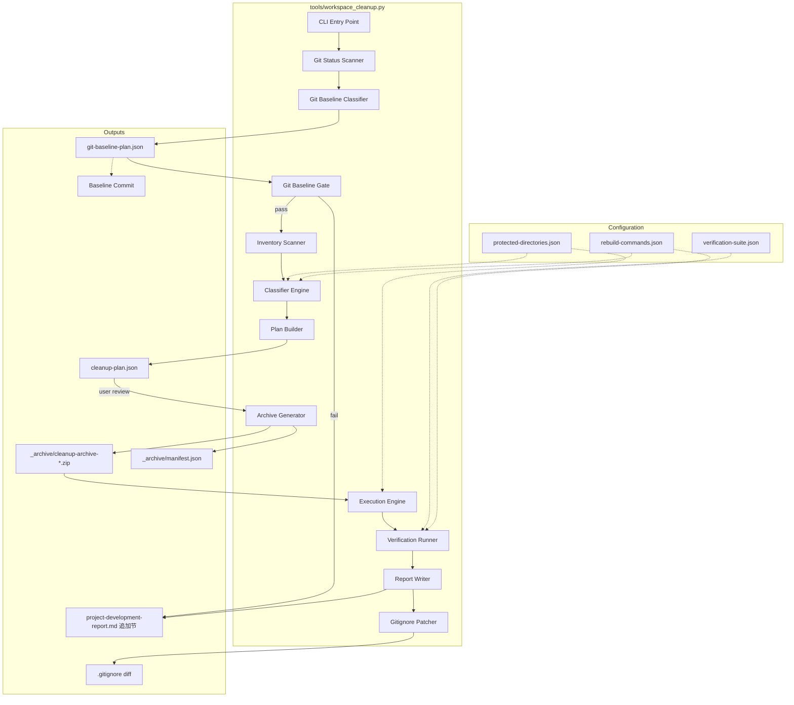
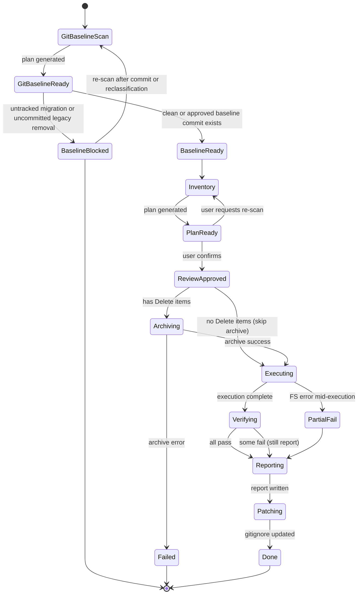

# Design Document — workspace-cleanup

## Overview

本设计描述一套 **工作区清理工程工具链**，将 Outer_Root (`e:\万朝归一\`) 与 Inner_Project (`e:\万朝归一\万朝归一\`) 中的散落资产整理成可信、可重建、可验证的工程化基线。

工具链由一个 Python CLI 脚本 `tools/workspace_cleanup.py`（置于 Inner_Project）驱动，实现 Stage 0 git 基线门禁 + 7 步清理流水线：

```
Git Baseline Gate → Inventory → Review Gate → Archive → Execute → Verify → Report → Gitignore
```

核心设计目标：
- **可复现**：清理前先确认纯代码迁移成果已经进入 git 历史，避免本机未跟踪文件制造假绿
- **确定性**：所有决策编码为 JSON Cleanup_Plan，不依赖人工记忆
- **可逆性**：Delete 操作前强制 Archive_Bundle + SHA-256 校验
- **安全性**：受保护目录硬编码前置校验，机制上阻止误删
- **可验证**：执行后自动运行 Verification_Suite 证明主线未损坏
- **防回归**：自动检测 .gitignore 缺口并生成补丁

技术约束：
- 仅使用 Python 3.10+ 标准库（`json`, `hashlib`, `zipfile`, `pathlib`, `subprocess`, `shutil`）
- Windows 路径（反斜杠），大小写不敏感比对
- Archive 格式为 `.zip`（Windows 原生支持，Python `zipfile` 内建）

## Architecture



### 状态机

7 步流水线由一个有限状态机控制：



## Components and Interfaces

### 1. CLI Entry Point (`workspace_cleanup.py`)

主入口，解析子命令，管理状态持久化。

```python
# 子命令
workspace_cleanup.py baseline      # Step 0: 生成 git-baseline-plan.json 并执行门禁判断
workspace_cleanup.py scan          # Step 1: 生成 cleanup-plan.json
workspace_cleanup.py approve       # Step 2: 标记 plan 为 approved
workspace_cleanup.py execute       # Steps 3-7: Archive → Execute → Verify → Report → Gitignore
workspace_cleanup.py status        # 查看当前流水线状态
```

### 0. Git Baseline Gate (`git_baseline.py`)

职责：在清理扫描前确认 Inner_Project 的 git 基线可复现。它只读取 git 状态和路径元数据，不删除、不移动、不 staging。

```python
@dataclass
class GitBaselineItem:
    path: str
    status_code: str              # M | D | ?? | A | R | ...
    tracked: bool
    classification: Literal[
        "Migration_Result",
        "Legacy_Removal",
        "Cleanup_Spec",
        "Generated_Artifact",
        "Unrelated_Local",
        "Needs_Review"
    ]
    recommended_action: Literal["Commit", "Ignore", "Keep_Local", "Reject", "Needs_Decision"]
    reason: str

@dataclass
class GitBaselinePlan:
    generated_at: str
    repository_root: str
    current_branch: str
    head_sha: str
    gate_status: Literal["pass", "fail"]
    items: list[GitBaselineItem]
    required_verification: list[str]
    local_only_evidence: list[str]

def build_git_baseline_plan(repo_root: Path) -> GitBaselinePlan: ...
def evaluate_git_baseline_gate(plan: GitBaselinePlan) -> tuple[bool, list[str]]: ...
```

分类规则：
- `domain-core/`、`web-strategy-map/game-data-source/`、`tools/validate_web_data_source.py` 和纯代码主线相关文档/脚本修改归为 `Migration_Result`
- `My project/`、`tools/unity/`、`tools/verify_unity_handoff.*`、`tools/validate_data.py`、tracked `.omc/`、tracked `.omx/` 删除归为 `Legacy_Removal`
- `.kiro/specs/workspace-cleanup/` 归为 `Cleanup_Spec`
- `dist/`、`node_modules/`、`public/game-data/`、`test-results/`、`playwright-report/`、`.outputs/` 归为 `Generated_Artifact`

门禁规则：
- untracked `Migration_Result` 导致 gate fail
- 未提交 `Legacy_Removal` 导致 gate fail
- untracked `tools/validate_web_data_source.py` 会把依赖它的验证结果降级为 `local-only evidence`
- gate fail 时只允许继续更新 `git-baseline-plan.json`、`.kiro/specs/workspace-cleanup/` 和 `project-development-report.md`

### 2. Inventory Scanner (`scanner.py`)

职责：遍历 Outer_Root 与 Inner_Project，收集候选 Inventory_Item。

```python
@dataclass
class InventoryItem:
    path: str                    # 绝对路径
    layer: Literal["Outer_Root", "Inner_Project"]
    item_type: Literal["File", "Directory"]
    size_bytes: int
    gitignore_covered: bool
    classification: str          # Foreign_Asset | Rebuildable_Artifact | Agent_Metadata | Temp_Output | ...
    disposition: Literal["Delete", "Archive", "Keep"]
    reason: str
    flags: list[str]             # ["outside-git", "Skip_Archive_Allowed", "pre-decided", ...]
    rebuild_command: str | None
    foreign_asset_scheme: Literal["A", "B", "C"] | None
    agent_metadata_scheme: Literal["M1", "M2"] | None

def scan_workspace(outer_root: Path, inner_project: Path) -> list[InventoryItem]: ...
```

### 3. Classifier Engine (`classifier.py`)

职责：对扫描结果进行分类与标注。

```python
def classify_item(item: InventoryItem, protected_dirs: list[str], rebuild_db: dict) -> InventoryItem: ...
def is_foreign_asset(path: str) -> bool: ...
def is_rebuildable(path: str, rebuild_db: dict) -> bool: ...
def is_agent_metadata(path: str) -> bool: ...
def check_truly_rebuildable(path: str, rebuild_db: dict) -> bool: ...
```

### 4. Protection Guard (`protection.py`)

职责：受保护目录前置校验。

```python
def load_protected_directories(config_path: Path) -> list[str]: ...
def is_protected(target_path: str, protected_dirs: list[str], inventory_items: list[str]) -> bool: ...
def validate_plan(plan: list[InventoryItem], protected_dirs: list[str]) -> list[str]:
    """返回违反保护规则的 item paths，空列表表示通过"""
    ...
```

### 5. Archive Generator (`archiver.py`)

职责：生成 Archive_Bundle 与 manifest.json。

```python
@dataclass
class ManifestEntry:
    original_path: str
    size_bytes: int
    sha256: str
    reason: str
    plan_line: int
    skipped: bool               # True if >1GiB and user approved skip
    skip_reason: str | None

def generate_archive(
    items_to_archive: list[InventoryItem],
    output_dir: Path,
    skip_large: set[str]        # paths user approved to skip
) -> tuple[Path, list[ManifestEntry]]: ...
```

### 6. Execution Engine (`executor.py`)

职责：按 Disposition 执行删除/移动操作。

```python
@dataclass
class ExecutionResult:
    item_path: str
    action: str
    success: bool
    error: str | None

def execute_plan(
    plan: list[InventoryItem],
    protected_dirs: list[str]
) -> list[ExecutionResult]: ...
```

### 7. Verification Runner (`verifier.py`)

职责：运行 Verification_Suite 并收集结果。

```python
@dataclass
class VerificationResult:
    command: str
    exit_code: int
    output_snippet: str         # 最后 50 行
    duration_ms: int
    prerequisite_ran: str | None

def run_verification_suite(
    suite_config: Path,
    deleted_items: list[str],
    rebuild_db: dict,
    cwd: Path
) -> list[VerificationResult]: ...
```

### 8. Report Writer (`reporter.py`)

职责：将清理结果追加到 `project-development-report.md`。

```python
def write_report(
    report_path: Path,
    plan: list[InventoryItem],
    archive_path: Path | None,
    verification_results: list[VerificationResult],
    foreign_asset_scheme: str,
    agent_metadata_scheme: str,
    gitignore_changes: list[str]
) -> None: ...
```

### 9. Gitignore Patcher (`gitignore_patcher.py`)

职责：检测 .gitignore 缺口并生成补丁。

```python
def find_uncovered_paths(
    deleted_inner_paths: list[str],
    gitignore_path: Path
) -> list[str]: ...

def generate_rules(uncovered_paths: list[str]) -> list[str]: ...

def apply_patch(gitignore_path: Path, new_rules: list[str], dry_run: bool = True) -> str:
    """返回 diff 字符串；dry_run=True 时不实际写入"""
    ...
```

## Data Models

### Cleanup_Plan JSON Schema

```json
{
  "$schema": "http://json-schema.org/draft-07/schema#",
  "title": "CleanupPlan",
  "type": "object",
  "required": ["version", "generated_at", "scope", "protected_directories", "items", "state"],
  "properties": {
    "version": { "type": "string", "const": "1.0" },
    "generated_at": { "type": "string", "format": "date-time" },
    "scope": {
      "type": "object",
      "properties": {
        "outer_root": { "type": "string" },
        "inner_project": { "type": "string" }
      }
    },
    "protected_directories": { "type": "array", "items": { "type": "string" } },
    "state": {
      "type": "string",
      "enum": ["draft", "approved", "executing", "archived", "verified", "reported", "done", "failed"]
    },
    "items": {
      "type": "array",
      "items": {
        "type": "object",
        "required": ["path", "layer", "item_type", "size_bytes", "gitignore_covered", "disposition", "reason"],
        "properties": {
          "path": { "type": "string" },
          "layer": { "enum": ["Outer_Root", "Inner_Project"] },
          "item_type": { "enum": ["File", "Directory"] },
          "size_bytes": { "type": "integer", "minimum": 0 },
          "gitignore_covered": { "type": "boolean" },
          "classification": {
            "enum": ["Foreign_Asset", "Rebuildable_Artifact", "Agent_Metadata", "Temp_Output", "Non_Rebuildable_Generated", "Other"]
          },
          "disposition": { "enum": ["Delete", "Archive", "Keep"] },
          "reason": { "type": "string", "minLength": 1 },
          "flags": { "type": "array", "items": { "type": "string" } },
          "rebuild_command": { "type": ["string", "null"] },
          "foreign_asset_scheme": { "enum": ["A", "B", "C", null] },
          "agent_metadata_scheme": { "enum": ["M1", "M2", null] }
        }
      }
    }
  }
}
```

### Git_Baseline_Plan JSON Schema

```json
{
  "$schema": "http://json-schema.org/draft-07/schema#",
  "title": "GitBaselinePlan",
  "type": "object",
  "required": ["version", "generated_at", "repository_root", "head_sha", "gate_status", "items"],
  "properties": {
    "version": { "type": "string", "const": "1.0" },
    "generated_at": { "type": "string", "format": "date-time" },
    "repository_root": { "type": "string" },
    "current_branch": { "type": "string" },
    "head_sha": { "type": "string" },
    "gate_status": { "enum": ["pass", "fail"] },
    "items": {
      "type": "array",
      "items": {
        "type": "object",
        "required": ["path", "status_code", "tracked", "classification", "recommended_action", "reason"],
        "properties": {
          "path": { "type": "string" },
          "status_code": { "type": "string" },
          "tracked": { "type": "boolean" },
          "classification": {
            "enum": ["Migration_Result", "Legacy_Removal", "Cleanup_Spec", "Generated_Artifact", "Unrelated_Local", "Needs_Review"]
          },
          "recommended_action": {
            "enum": ["Commit", "Ignore", "Keep_Local", "Reject", "Needs_Decision"]
          },
          "reason": { "type": "string", "minLength": 1 }
        }
      }
    },
    "required_verification": { "type": "array", "items": { "type": "string" } },
    "local_only_evidence": { "type": "array", "items": { "type": "string" } }
  }
}
```

### manifest.json Schema

```json
{
  "$schema": "http://json-schema.org/draft-07/schema#",
  "title": "ArchiveManifest",
  "type": "object",
  "required": ["archive_name", "created_at", "entries"],
  "properties": {
    "archive_name": { "type": "string" },
    "created_at": { "type": "string", "format": "date-time" },
    "total_size_bytes": { "type": "integer" },
    "entries": {
      "type": "array",
      "items": {
        "type": "object",
        "required": ["original_path", "size_bytes", "sha256", "reason", "plan_line"],
        "properties": {
          "original_path": { "type": "string" },
          "size_bytes": { "type": "integer" },
          "sha256": { "type": "string", "pattern": "^[a-f0-9]{64}$" },
          "reason": { "type": "string" },
          "plan_line": { "type": "integer" },
          "skipped": { "type": "boolean", "default": false },
          "skip_reason": { "type": ["string", "null"] }
        }
      }
    }
  }
}
```

### protected-directories.json

存放路径：`e:\万朝归一\万朝归一\tools\cleanup-config\protected-directories.json`

```json
{
  "version": "1.0",
  "directories": [
    "e:\\万朝归一\\万朝归一\\.git\\",
    "e:\\万朝归一\\万朝归一\\domain-core\\src\\",
    "e:\\万朝归一\\万朝归一\\web-strategy-map\\src\\",
    "e:\\万朝归一\\万朝归一\\web-strategy-map\\game-data-source\\",
    "e:\\万朝归一\\万朝归一\\docs\\",
    "e:\\万朝归一\\万朝归一\\tools\\",
    "e:\\万朝归一\\万朝归一\\.kiro\\"
  ],
  "files": [
    "e:\\万朝归一\\万朝归一\\AGENTS.md",
    "e:\\万朝归一\\万朝归一\\CLAUDE.md",
    "e:\\万朝归一\\万朝归一\\project-development-report.md",
    "e:\\万朝归一\\万朝归一\\.gitignore"
  ]
}
```

### verification-suite.json

存放路径：`e:\万朝归一\万朝归一\tools\cleanup-config\verification-suite.json`

```json
{
  "version": "1.0",
  "commands": [
    {
      "name": "validate_domain_core",
      "command": "python tools/validate_domain_core.py",
      "timeout_seconds": 120,
      "prerequisite": null
    },
    {
      "name": "validate_web_data_source",
      "command": "python tools/validate_web_data_source.py",
      "timeout_seconds": 120,
      "prerequisite": null
    },
    {
      "name": "check_data_source",
      "command": "npm --prefix web-strategy-map run check:data-source",
      "timeout_seconds": 180,
      "prerequisite": "npm --prefix web-strategy-map install",
      "prerequisite_trigger": "web-strategy-map/node_modules/"
    },
    {
      "name": "verify_headless_war",
      "command": "powershell -NoProfile -ExecutionPolicy Bypass -File tools\\verify_headless_war.ps1",
      "timeout_seconds": 300,
      "prerequisite": null
    }
  ]
}
```

### rebuild-commands.json

存放路径：`e:\万朝归一\万朝归一\tools\cleanup-config\rebuild-commands.json`

```json
{
  "version": "1.0",
  "mappings": {
    "web-strategy-map/node_modules/": "npm --prefix web-strategy-map install",
    "web-strategy-map/dist/": "npm --prefix web-strategy-map run build",
    "web-strategy-map/public/game-data/": "npm --prefix web-strategy-map run check:data-source",
    "web-strategy-map/playwright-report/": "npx --prefix web-strategy-map playwright test",
    "web-strategy-map/test-results/": "npx --prefix web-strategy-map playwright test",
    "web-strategy-map/dev-server.log": null,
    ".outputs/playwright/": "npx --prefix web-strategy-map playwright test"
  }
}
```

## Correctness Properties

*A property is a characteristic or behavior that should hold true across all valid executions of a system — essentially, a formal statement about what the system should do. Properties serve as the bridge between human-readable specifications and machine-verifiable correctness guarantees.*

### Property 1: Layer Classification Correctness

*For any* absolute path in the Workspace_Tree, the layer classification function SHALL assign `Outer_Root` if and only if the path starts with the Outer_Root prefix but NOT the Inner_Project prefix, and `Inner_Project` if the path starts with the Inner_Project prefix. Additionally, any path classified as `Outer_Root` SHALL carry the `outside-git` flag.

**Validates: Requirements 1.1, 1.5**

### Property 0: Git Baseline Gate Correctness

*For any* git status snapshot, if it contains an untracked `Migration_Result` item or an uncommitted `Legacy_Removal` item, the gate SHALL return `fail`. If all Migration_Result, Legacy_Removal, and Cleanup_Spec items are tracked and no Needs_Review blocker remains, the gate MAY return `pass`.

**Validates: Requirements 11.1, 11.7, 11.8, 11.13, 11.14**

### Property 2: Protected Directory Invariant

*For any* Cleanup_Plan and any operation target path, if the path is inside a protected directory AND is not explicitly listed as an Inventory_Item, then the protection guard function SHALL return `blocked=true`, preventing Delete or Archive operations. Conversely, if a path is NOT inside any protected directory, the guard SHALL return `blocked=false`.

**Validates: Requirements 1.2, 1.3, 1.4, 7.4**

### Property 3: Inventory_Item Schema Completeness

*For any* valid InventoryItem object, serializing it to JSON and deserializing it back SHALL produce an equivalent object with all required fields present (path, layer, item_type, size_bytes, gitignore_covered, disposition, reason).

**Validates: Requirements 2.2**

### Property 4: Disposition Reason Validity

*For any* Inventory_Item with Disposition `Delete`, its reason field SHALL reference at least one valid deletion category (Rebuildable_Artifact, Temp_Output, Expired_Log, Agent_Metadata, or confirmed Foreign_Asset). *For any* Inventory_Item with Disposition `Keep`, its reason field SHALL be non-empty and reference a valid retention basis.

**Validates: Requirements 2.4, 2.5**

### Property 5: Foreign_Asset Scheme Selection

*For any* Foreign_Asset item with confirmation state (source_confirmed, ownership_confirmed, relationship_confirmed), if the number of confirmed dimensions is ≥ 2 then schemes A, B, or C are all valid selections; if < 2 then only schemes A or B are valid and scheme C SHALL be rejected.

**Validates: Requirements 3.3, 3.4**

### Property 6: Foreign_Asset Bundle Integrity

*For any* Foreign_Asset archive operation (scheme A), the resulting Archive_Bundle SHALL contain both the `.pth` weight files AND their corresponding `tools/ml/*.py` training scripts as a single unit — neither may appear in the archive without the other.

**Validates: Requirements 3.5**

### Property 7: Rebuildable Classification Integrity

*For any* item initially classified as Rebuildable_Artifact, if the rebuild commands database contains no matching command for that path, the classification function SHALL reclassify it as a pending-confirmation item with Disposition != Delete. Furthermore, if content analysis detects non-rebuildable material (external API products, etc.), the item SHALL be reclassified as Non_Rebuildable_Generated.

**Validates: Requirements 4.2, 4.3, 4.6**

### Property 8: Archive Manifest Schema Completeness

*For any* entry in manifest.json, all required fields SHALL be present: original_path (non-empty string), size_bytes (non-negative integer), sha256 (64-char hex string), reason (non-empty string), and plan_line (positive integer).

**Validates: Requirements 6.4**

### Property 9: Archive Generation Trigger

*For any* Cleanup_Plan, the archive generation step SHALL execute if and only if at least one Inventory_Item has Disposition `Delete`. A plan with zero Delete items SHALL skip archive generation entirely.

**Validates: Requirements 6.1, 6.2**

### Property 10: Large Item Skip Logic

*For any* Inventory_Item with Disposition `Delete` and size_bytes > 1 GiB, it SHALL be flagged as `Skip_Archive_Allowed`. When the skip is activated (user consent), the manifest SHALL contain a metadata-only entry with `skipped=true` and a non-null skip_reason.

**Validates: Requirements 6.6**

### Property 11: Pipeline State Machine Validity

*For any* sequence of state transitions in the 7-step pipeline, only forward transitions following the defined order SHALL be allowed. Specifically: Step 3 (Archive) SHALL be unreachable unless the plan state is `approved`; execution SHALL not begin unless archive succeeds (or is skipped for no-Delete plans).

**Validates: Requirements 7.1, 7.2**

### Property 12: Verification Status Determination

*For any* set of VerificationResults, the overall cleanup status SHALL be `Pass` if and only if ALL results have exit_code == 0. If any result has exit_code != 0, the status SHALL be `Fail`.

**Validates: Requirements 7.5, 8.5**

### Property 13: Verification Prerequisite Injection

*For any* verification command whose dependency path appears in the deleted items list, the verification runner SHALL execute the prerequisite rebuild command before running the verification command itself.

**Validates: Requirements 8.3**

### Property 14: Verification Result Recording

*For any* executed verification command, the result SHALL record exit_code (integer), output_snippet (string, last 50 lines), and duration_ms (non-negative integer).

**Validates: Requirements 8.4**

### Property 15: Report Content Completeness

*For any* completed cleanup flow, the report section written to `project-development-report.md` SHALL contain: scope description, disposition count statistics, archive path (or "无需备份"), all verification results, foreign asset scheme selection, and agent metadata scheme selection.

**Validates: Requirements 9.2**

### Property 16: Gitignore Coverage Completeness

*For any* set of deleted paths within Inner_Project and a set of existing .gitignore rules, the gitignore gap detection function SHALL correctly identify all deleted paths not covered by any existing rule. The generated rules SHALL, when applied, cover all previously uncovered paths.

**Validates: Requirements 10.1, 10.2**

## Error Handling

### 错误分级

| 级别 | 触发条件 | 行为 |
|------|---------|------|
| **FATAL** | Archive 生成失败、manifest 写入失败 | 立即中止，不执行任何删除，报告原因 |
| **HALT** | 执行阶段文件系统错误（权限拒绝、文件被占用） | 停止剩余操作，记录已完成/未完成项，报告 |
| **WARN** | 验证命令非零退出码 | 标记为 Fail，继续执行后续验证命令，最终报告汇总 |
| **INFO** | 重建前置执行、跳过大文件 Archive | 记录日志，正常继续 |

### 错误恢复策略

1. **Archive 失败**：状态机进入 `Failed`，用户可排除故障后重新运行 `execute` 子命令
2. **执行中断**：已删除文件无法撤回（但已在 Archive 中），未执行项保持原状，用户可修复后重新运行
3. **验证失败**：保留 Archive_Bundle，在报告中给出回滚指引（解压 Archive 恢复文件）

### 关键保护机制

- **双重保护校验**：Protection Guard 在 plan 生成时校验一次，在执行时逐条再校验一次
- **Archive 先于 Delete**：状态机强制 Archiving → Executing 顺序，跳过不可能
- **SHA-256 校验**：Archive 完成后可选验证步骤，确认打包内容完整性

## Testing Strategy

### 测试框架

- **单元测试**：`pytest` + 标准 `unittest.mock`
- **Property-based 测试**：`hypothesis` (Python)
- 测试文件存放于 `tools/tests/test_workspace_cleanup/`

### 双测试方法

**Property-based 测试**（覆盖 Correctness Properties 1-16）：
- 每个属性对应一个 `@given` 测试函数
- 最低 100 次迭代（`@settings(max_examples=100)`）
- 每个测试标注 `# Feature: workspace-cleanup, Property N: ...`

**Example-based 单元测试**（覆盖具体场景）：
- 已知候选条目覆盖检查（Req 2.3）
- 状态机非法转换拒绝（Req 7.2）
- 文件系统错误时中止（Req 7.3）
- Archive 失败时无删除（Req 6.5）
- .omc/ Agent_Metadata 分类（Req 5.1）
- 方案 B sandbox README 内容（Req 10.4）

### 集成测试

使用临时目录（`tempfile.TemporaryDirectory`）模拟 Workspace_Tree 结构：
- 端到端跑完 scan → approve → execute 全流程
- 验证 Archive 可解压并与 manifest 一致
- 验证 .gitignore 补丁正确覆盖

### 测试配置

```python
# conftest.py
from hypothesis import settings
settings.register_profile("ci", max_examples=200)
settings.register_profile("dev", max_examples=100)
settings.load_profile("dev")
```
