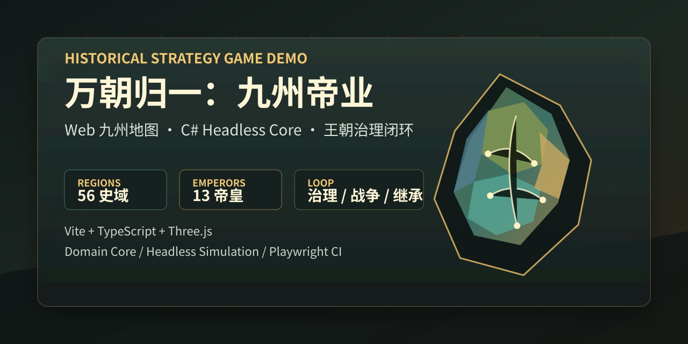
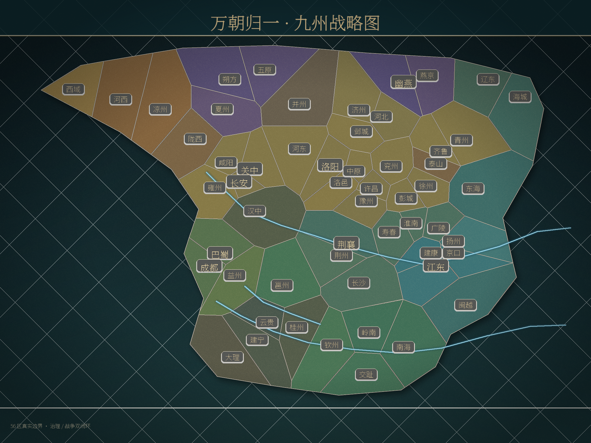

# 万朝归一：九州帝业


纯代码历史策略 Demo。项目以「帝皇机制 + 九州统一 + 王朝治理 + 继承风险」为第一阶段闭环，当前主线是 `web-strategy-map` 的 Three.js 可玩原型和 `domain-core/src` 的 headless 玩法核心。





## 当前看点

- 56 个史域九州地区，带地形、水系、区域面片、建设标记和归属层。
- 13 位帝皇，包含 8 位核心 MVP 帝皇和 5 位区域帝皇，每位都有可解释机制。
- 治理、战争、继承、法统、人才、编年事件、胜利条件和 AI 倾向已接入 Web 原型。
- Web 数据源统一放在 `web-strategy-map/game-data-source`，运行前同步到忽略目录。
- C# Domain Core 保持脱离编辑器，可用命令行做 headless 验证。

## 快速运行

```powershell
cd web-strategy-map
npm ci
npm run dev
```

默认本地地址由 Vite 输出，常用为 `http://127.0.0.1:5173/`。

## 常用验证

```powershell
python tools\validate_web_data_source.py
python tools\validate_domain_core.py
npm --prefix web-strategy-map run typecheck
npm --prefix web-strategy-map run test:ui
npm --prefix web-strategy-map run build
```

完整 CI 入口：

```powershell
tools\run_all_checks.ps1
```

## 目录导览

| 路径 | 作用 |
| --- | --- |
| `web-strategy-map/` | Vite + TypeScript + Three.js Web 游戏主线 |
| `web-strategy-map/game-data-source/` | 权威 JSON、地图、音频和美术源 |
| `domain-core/src/` | 纯代码 C# 玩法核心 |
| `tools/` | 数据校验、headless 验证和构建辅助脚本 |
| `docs/` | MVP 设计、架构、数据契约和验收记录 |
| `project-development-report.md` | 项目唯一权威开发记录 |

## 设计边界

MVP 聚焦国内版 Demo，不做全球地图、多人联机、复杂实时战斗或大型 3D 美术。统一目标不是单纯占满地图，而是建立可延续的王朝秩序。

## 文档入口

- [MVP 设计](docs/mvp-design.md)
- [系统架构](docs/architecture.md)
- [数据契约](docs/data-contract.md)
- [12 周路线图](docs/roadmap-12-weeks.md)
- [MVP 闭环台账](docs/mvp-closure-ledger.md)

## 协作入口

- [贡献说明](CONTRIBUTING.md)
- [安全策略](SECURITY.md)
- [支持范围](SUPPORT.md)
- [行为准则](CODE_OF_CONDUCT.md)
